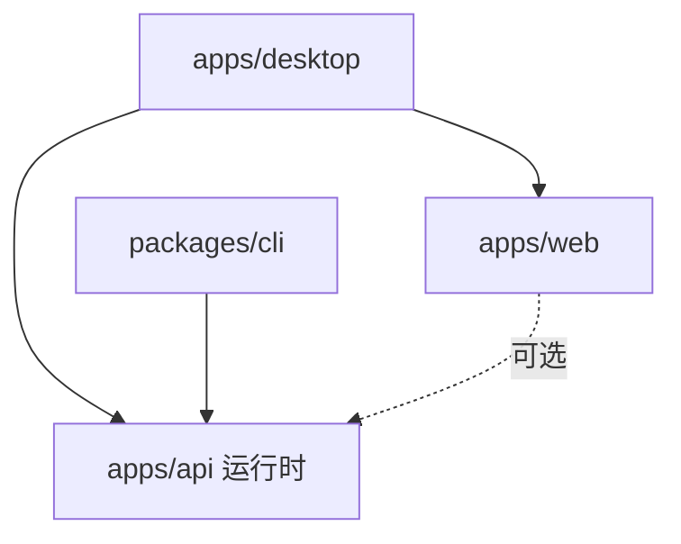

# 项目架构文档

## 概述

本项目采用 Monorepo 架构，集成了多种技术栈，形成一个完整的全栈应用生态系统。

## 架构图

```
┌─────────────────────────────────────────────────────────────┐
│                       Monorepo Root                          │
│                  (Bun Workspaces + Turborepo)                │
└─────────────────────────────────────────────────────────────┘
                              │
                              │
        ┌─────────────────────┼─────────────────────┐
        │                     │                     │
        ▼                     ▼                     ▼
  ┌─────────┐          ┌──────────┐         ┌──────────┐
  │  apps/  │          │packages/ │         │  共享配置  │
  └─────────┘          └──────────┘         └──────────┘
        │                     │                     │
        │                     │                     │
   ┌────┼────┬────┐          │              ┌──────┴──────┐
   │    │    │    │          │              │             │
   ▼    ▼    ▼    ▼          ▼              ▼             ▼
┌─────┐ ┌────┐ ┌────┐   ┌──────┐    turbo.json    .gitignore
│ api │ │web │ │desk│   │ cli  │
└─────┘ └────┘ └────┘   └──────┘
```

## 项目结构

```
monorepo/
├── apps/                    # 应用程序
│   ├── api/                # Python FastAPI 后端
│   │   ├── api/           # API 源代码
│   │   │   ├── __init__.py
│   │   │   ├── main.py    # FastAPI 应用入口
│   │   │   └── routers/   # API 路由
│   │   ├── pyproject.toml # Python 项目配置（uv）
│   │   └── package.json   # NPM 脚本配置
│   │
│   ├── web/               # Svelte 前端应用
│   │   ├── src/
│   │   │   ├── lib/      # 组件库
│   │   │   │   ├── components/
│   │   │   │   │   ├── ui/       # UI 组件
│   │   │   │   │   └── charts/   # 图表组件
│   │   │   │   └── utils.ts      # 工具函数
│   │   │   └── routes/   # SvelteKit 路由
│   │   ├── package.json
│   │   ├── svelte.config.js
│   │   ├── tailwind.config.ts
│   │   └── vite.config.ts
│   │
│   └── desktop/          # Tauri 桌面应用
│       ├── src/          # 前端资源（轻量）
│       ├── src-tauri/    # Rust 后端
│       │   ├── src/
│       │   │   ├── lib.rs    # Tauri 命令
│       │   │   └── main.rs   # 入口文件
│       │   ├── Cargo.toml
│       │   └── tauri.conf.json
│       └── package.json
│
├── packages/             # 共享包
│   └── cli/             # CLI 工具
│       ├── src/
│       │   └── index.ts # CLI 实现
│       ├── bin.ts       # CLI 入口
│       └── package.json
│
├── package.json         # 根 package.json（workspaces）
├── turbo.json          # Turborepo 配置
└── bun.lockb           # Bun 锁文件
```

## 技术栈详解

### 1. 包管理和任务运行

#### Bun (替代 npm/yarn)
- **用途**: JavaScript/TypeScript 包管理器和运行时
- **优势**: 
  - 比 npm/yarn 快 10-100 倍
  - 内置 TypeScript 支持
  - 兼容 npm 生态
- **使用场景**: 
  - 安装和管理 JS/TS 依赖
  - 运行 TypeScript 脚本
  - 构建和打包

#### uv (Python 包管理器)
- **用途**: Python 依赖管理
- **优势**:
  - 比 pip 快 10-100 倍
  - Rust 实现，高性能
  - 兼容 pip/poetry
- **使用场景**:
  - 安装 Python 包
  - 管理虚拟环境
  - 依赖解析

#### Turborepo
- **用途**: Monorepo 任务编排和缓存
- **功能**:
  - 并行任务执行
  - 智能缓存
  - 依赖图分析
  - 增量构建

### 2. 后端 API (apps/api)

#### 技术栈
- **Python 3.12+**
- **FastAPI**: 现代、快速的 Web 框架
- **Pydantic**: 数据验证
- **Uvicorn**: ASGI 服务器

#### 架构
```
apps/api/
├── api/
│   ├── main.py          # FastAPI 应用
│   ├── routers/         # 路由模块
│   │   ├── health.py    # 健康检查
│   │   └── items.py     # 数据 CRUD
│   └── models/          # 数据模型（可扩展）
└── tests/               # 测试（可扩展）
```

#### 特性
- RESTful API 设计
- 自动生成 OpenAPI 文档
- CORS 支持
- 类型安全（Pydantic）
- 异步支持

### 3. 前端应用 (apps/web)

#### 技术栈
- **Svelte 5**: 响应式 UI 框架
- **SvelteKit**: 全栈框架
- **TypeScript**: 类型安全
- **Tailwind CSS**: 实用优先的 CSS
- **shadcn-svelte**: UI 组件库
- **Chart.js**: 图表库

#### 架构
```
apps/web/src/
├── lib/
│   ├── components/
│   │   ├── ui/          # 基础 UI 组件
│   │   │   ├── button.svelte
│   │   │   ├── card.svelte
│   │   │   ├── badge.svelte
│   │   │   └── input.svelte
│   │   └── charts/      # 图表组件
│   │       ├── LineChart.svelte
│   │       └── BarChart.svelte
│   └── utils.ts         # 工具函数
└── routes/
    ├── +layout.svelte   # 布局
    └── +page.svelte     # 主页（Dashboard）
```

#### 特性
- 响应式设计
- 组件化开发
- 类型安全
- 热模块替换
- 静态站点生成（SSG）

### 4. 桌面应用 (apps/desktop)

#### 技术栈
- **Tauri 2.0**: 桌面应用框架
- **Rust**: 后端语言
- **Web 前端**: 复用 apps/web

#### 架构
```
apps/desktop/
├── src-tauri/
│   ├── src/
│   │   ├── lib.rs       # Tauri 命令
│   │   └── main.rs      # 入口
│   ├── Cargo.toml       # Rust 依赖
│   └── tauri.conf.json  # Tauri 配置
└── package.json
```

#### 集成方式
- 构建时：从 apps/web 打包前端
- 开发时：代理到 apps/web 开发服务器
- 通信：Tauri IPC（invoke 命令）

#### 特性
- 跨平台（Windows、macOS、Linux）
- 小体积（比 Electron 小 10-100 倍）
- 原生性能
- 系统级 API 访问

### 5. CLI 工具 (packages/cli)

#### 技术栈
- **Bun**: 运行时
- **TypeScript**: 开发语言
- **Commander.js**: CLI 框架
- **Chalk**: 彩色输出
- **Ora**: 加载动画

#### 架构
```
packages/cli/
├── src/
│   └── index.ts         # CLI 实现
├── bin.ts               # 入口脚本
└── package.json
```

#### 功能
- 项目信息显示
- API 健康检查
- 数据查询
- 构建辅助

## 数据流

### 1. Web 应用数据流
```
User → Svelte Component → API Request → FastAPI → Response → Update UI
```

### 2. 桌面应用数据流
```
User → Svelte Component → Tauri Invoke → Rust Command → Response → Update UI
                          ↓
                    HTTP Request → FastAPI
```

### 3. CLI 数据流
```
User → CLI Command → HTTP Request → FastAPI → Response → Console Output
```

## 构建流程

### 开发模式
```
bun run dev
    ↓
Turborepo 启动
    ↓
并行执行:
    ├─ apps/api: uv run uvicorn
    ├─ apps/web: vite dev
    ├─ apps/desktop: tauri dev (依赖 web)
    └─ packages/cli: 可手动运行
```

### 生产构建
```
bun run build
    ↓
Turborepo 构建
    ↓
按依赖顺序:
    1. apps/web: vite build
    2. apps/desktop: tauri build (使用 web 输出)
    3. packages/cli: bun build
```

## 依赖关系



## 配置文件

### 根配置
- `package.json`: Bun workspaces 配置
- `turbo.json`: Turborepo 任务配置
- `.gitignore`: Git 忽略规则

### 项目特定配置

#### API (Python)
- `pyproject.toml`: 项目元数据和依赖
- `package.json`: NPM 脚本

#### Web (Svelte)
- `svelte.config.js`: Svelte 配置
- `vite.config.ts`: Vite 配置
- `tailwind.config.ts`: Tailwind 配置
- `tsconfig.json`: TypeScript 配置

#### Desktop (Tauri)
- `tauri.conf.json`: Tauri 配置
- `Cargo.toml`: Rust 依赖
- `vite.config.ts`: Vite 配置

#### CLI
- `tsconfig.json`: TypeScript 配置

## 性能优化

### 1. Turborepo 缓存
- 任务结果缓存
- 远程缓存支持
- 增量构建

### 2. Bun 性能
- 快速包安装
- 原生 TypeScript 支持
- 高性能运行时

### 3. uv 性能
- Rust 实现
- 并行安装
- 智能依赖解析

### 4. 构建优化
- Tree shaking
- 代码分割
- 静态资源优化

## 安全考虑

### 1. API 安全
- CORS 配置
- 输入验证（Pydantic）
- 环境变量管理

### 2. 桌面应用安全
- Tauri 安全策略
- IPC 命令白名单
- CSP 配置

### 3. 依赖安全
- 定期更新依赖
- 漏洞扫描

## 扩展性

### 添加新的应用
1. 在 `apps/` 创建新目录
2. 添加 `package.json`
3. 在根 `package.json` 的 workspaces 中注册
4. 在 `turbo.json` 配置任务

### 添加新的包
1. 在 `packages/` 创建新目录
2. 添加 `package.json`
3. 其他应用可通过 `workspace:*` 引用

### 添加新的路由（API）
1. 在 `apps/api/api/routers/` 创建新文件
2. 在 `main.py` 注册路由

### 添加新的页面（Web）
1. 在 `apps/web/src/routes/` 创建新路由
2. SvelteKit 自动识别

## 最佳实践

1. **代码组织**: 按功能模块组织代码
2. **类型安全**: 使用 TypeScript 和 Python 类型注解
3. **组件复用**: 创建可复用的 UI 组件
4. **错误处理**: 统一的错误处理机制
5. **测试**: 编写单元测试和集成测试
6. **文档**: 保持文档更新

## 未来改进

- [ ] 添加数据库集成（PostgreSQL/SQLite）
- [ ] 添加身份认证（JWT/OAuth）
- [ ] 添加 WebSocket 支持
- [ ] 添加 E2E 测试
- [ ] 添加 Docker 支持
- [ ] 添加 CI/CD 配置
- [ ] 添加监控和日志
- [ ] 添加国际化（i18n）
