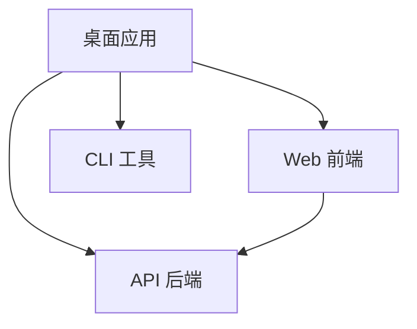

# 项目架构

## 概述

这是一个基于 Turborepo 的 Monorepo 项目模板，包含多个不同技术栈的子项目。

## 技术栈

### 前端 (apps/web)
- **框架**: SvelteKit 2.x
- **UI**: Svelte 5 + Tailwind CSS
- **组件库**: bits-ui (headless components)
- **图标**: Lucide Svelte
- **构建工具**: Vite
- **包管理**: Bun

### 后端 (apps/api)
- **框架**: FastAPI
- **包管理**: uv
- **Python**: 3.12+
- **服务器**: Uvicorn

### 桌面应用 (apps/desktop)
- **框架**: Tauri 2.0
- **前端**: TypeScript + Vite
- **后端**: Rust
- **打包**: Tauri CLI

### CLI 工具 (packages/cli)
- **运行时**: Bun
- **语言**: TypeScript
- **命令行**: Commander.js
- **UI**: Chalk + Ora

### Monorepo 管理
- **任务运行**: Turborepo
- **包管理**: Bun workspaces
- **版本控制**: Git

## 项目结构

```
monorepo-template/
├── apps/
│   ├── api/              # FastAPI 后端
│   │   ├── api/          # Python 源码
│   │   ├── pyproject.toml
│   │   └── package.json  # Turborepo 集成
│   ├── web/              # Svelte 前端
│   │   ├── src/
│   │   │   ├── lib/      # 组件和工具
│   │   │   └── routes/   # SvelteKit 路由
│   │   └── package.json
│   └── desktop/          # Tauri 桌面应用
│       ├── src/          # 前端源码
│       ├── src-tauri/    # Rust 后端
│       └── package.json
├── packages/
│   └── cli/              # CLI 工具
│       ├── src/
│       └── package.json
├── scripts/              # 开发脚本
├── docs/                 # 项目文档
├── package.json          # 根配置
└── turbo.json           # Turborepo 配置
```

## 依赖关系



## 开发工作流

### 1. 启动开发环境

```bash
# 启动所有服务
bun dev

# 这将并行启动：
# - Web: http://localhost:5173
# - API: http://localhost:8000
# - Desktop: Tauri 开发窗口
# - CLI: 监听模式
```

### 2. 单独开发某个项目

```bash
# 仅启动 Web
bun dev --filter=web

# 仅启动 API
bun dev --filter=api

# 仅启动桌面应用
bun dev --filter=desktop

# 仅启动 CLI
bun dev --filter=cli
```

### 3. 构建

```bash
# 构建所有项目
bun run build

# 构建特定项目
bun run build --filter=web
```

## 任务管道

Turborepo 会自动处理任务依赖：

```
build:
  web → desktop
  api (独立)
  cli → desktop

dev:
  所有项目并行启动

test:
  依赖 build 完成
```

## 端口分配

- **Web 前端**: 5173
- **API 后端**: 8000
- **Desktop (Vite)**: 5174
- **Desktop (HMR)**: 5175

## 环境变量

每个项目可以有自己的 `.env` 文件：

- `apps/web/.env` - Web 前端环境变量
- `apps/api/.env` - API 后端环境变量
- `apps/desktop/.env` - 桌面应用环境变量

## 最佳实践

### 1. 代码组织
- 共享类型定义放在 `packages/` 下
- 特定于应用的代码放在对应的 `apps/` 目录
- 工具函数可以提取为共享包

### 2. 依赖管理
- 尽量使用 workspace 共享依赖
- 特定版本的包单独安装在项目中

### 3. 构建优化
- Turborepo 会缓存构建结果
- 只有变更的项目才会重新构建

### 4. 测试策略
- 单元测试在各自项目中
- 集成测试可以在根目录统一管理

## 扩展项目

### 添加新的 App

1. 在 `apps/` 下创建新目录
2. 添加 `package.json` 并设置 name
3. 在根 `package.json` 的 workspaces 中会自动识别
4. 在 `turbo.json` 中配置任务

### 添加新的 Package

1. 在 `packages/` 下创建新目录
2. 添加 `package.json`
3. 在需要的项目中引用：`"@monorepo/package-name": "workspace:*"`

## 性能优化

- **并行执行**: Turborepo 自动并行执行无依赖的任务
- **增量构建**: 只构建变更的项目
- **远程缓存**: 可配置远程缓存服务器（Vercel）
- **代码分割**: Web 和 Desktop 使用 Vite 的代码分割

## 部署

### Web 前端
- 构建：`bun run build --filter=web`
- 输出：`apps/web/.svelte-kit/output`
- 适配器：默认使用 `adapter-auto`

### API 后端
- 使用 Docker 容器化
- 或直接使用 `uv run start`

### 桌面应用
- 构建：`bun run build --filter=desktop`
- 输出：
  - Linux: `apps/desktop/src-tauri/target/release/bundle/`
  - macOS: `.app` 和 `.dmg`
  - Windows: `.exe` 和 `.msi`

### CLI 工具
- 构建：`bun run build --filter=cli`
- 可以发布到 npm 或作为二进制分发
